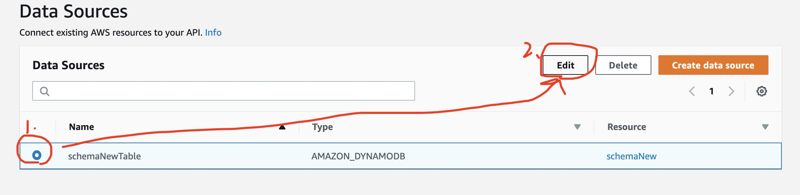
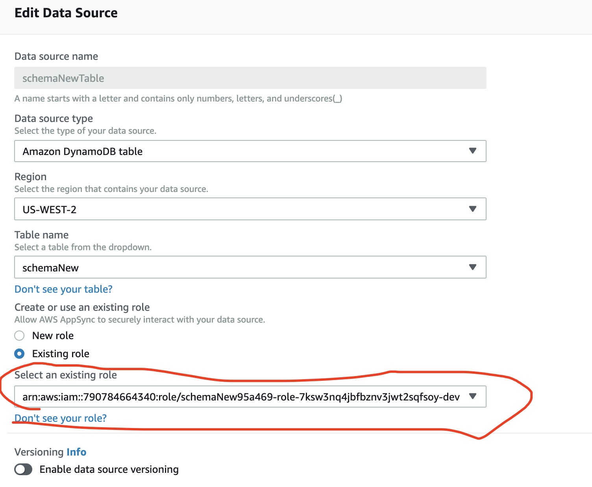

# Getting Started with Amplify CLI
This directory was generated by [Amplify CLI](https://docs.amplify.aws/cli).

Helpful resources:
- Amplify documentation: https://docs.amplify.aws
- Amplify CLI documentation: https://docs.amplify.aws/cli
- More details on this folder & generated files: https://docs.amplify.aws/cli/reference/files
- Join Amplify's community: https://amplify.aws/community/

# Resources and Name:
| Resource     | Name |
| ----------- | ----------- |
| Cloud Deployment Link      | https://main.d2lsmg6fxz0aqr.amplifyapp.com/      |
| Amplify App Name   | DashboardRework        |
DynamoDB table | schemaNew |
S3 bucket name | aerospec-dashboard-user-data-storage160954-dev |
AppSync GraphQL Api name | dashboardrework-dev

# Table of Content
- [Understand the Dashboard Backend Structure](#understand-the-dashboard-backend-structure)
- [GraphQL/API](#graphql-api)
  - [JS code sample for Make a Call to Fetch Data](#js-code-for-make-a-call-to-fetch-data)
  - [Change Schema for GraphQL](#changing-schema-for-graphqL)
    - [TroubleShooting](#troubleshooting)
  - [Remove API and Add it Back](#remove-api-completely-and-add-back)
- [S3 bucket/Storage](#s3-bucket)
  - [JS code sample Upload and download files](#js-code-for-uploading-and-downloading-files)
  - [Remove and Initial Set Up](#remove-and-initial-set-up)
- [Device Register API](#device-register-api)
  - [Code example](#code-example)

# Understand the Dashboard Backend Structure
The backend consist three parts, GraphQL API, S3 storage, and Device Register Gateway API.
- GraphQL API is used for fetching data in AWS DynamoDB. DynamoDB is the queriable data table created by devices. data collected *by devices* will be stored there.
- S3 bucket is used for storing setting data(including device location) and user uploaded floor plans. Any information collected for single user will be stored inside S3 bucket
- Device Register Gateway API is used for register device into the IoT core.

# GraphQL API
[Official Tutorial](https://docs.amplify.aws/lib/graphqlapi/getting-started/q/platform/js#enable-queries-mutations-and-subscriptions)
> When I use the word "xx console" you could go to the AWS main console and search the keyword in the search bar to find that particular console
. If I mentioned resource name, you could take a look at the "Resource & Name" section for more detail
## JS code for Make a Call to Fetch Data
Here is a complete code example for fetching and display on the page with string. You should especially take a look at the async function getDeviceInfo and listDeviceInfo. Also, please take a look at autogenerated query code in folder ```./src/graphql``` for CRUD operation to DynamoDB table.
```JavaScript
import {getSchemaNew, listSchemaNews} from '../../../graphql/queries';
import { API } from 'aws-amplify';
import React, { useEffect, useState } from "react";
import Box from '@material-ui/core/Box';
import { makeStyles } from '@material-ui/core';

const RegulatoryAnalysisComponent = () => {
  const useStyles = makeStyles(() => ({
    RAContainer: {
       display: 'flex',
       flexDirection: 'column',
       justifyContent: 'center',
       margin: '3vh 5vh 3vh 5vh',
    }
 }));
   const initialDeviceData = {data: ''};
   const classes = useStyles();
   let [deviceData, setDeviceData] = useState(initialDeviceData);
   const initialDeviceGetData = {data: ''};
   let [deviceGetData, setDeviceGetData] = useState(initialDeviceGetData);
   async function listDeviceInfo() {
      console.log("listDeviceInfo");
      try {
        const store = await API.graphql({ query: listSchemaNews });
        const info = store.data.listSchemaNews;
        console.log("info items", store);
        setDeviceData(info.items);
        console.log("deviceData", deviceData);
      } catch (err) {
        console.log(err);
      }
    }

    async function getDeviceInfo() {
      try {
        const store = await API.graphql({ query: getSchemaNew, variables: {id: '2', time: '114121'}});
        const info = store.data.getSchemaNew;
        console.log("get items", store);
        setDeviceGetData(info);
        console.log("deviceGetData", deviceGetData);
      } catch (err) {
        console.log(err);
      }
    }

    useEffect(() => {
      listDeviceInfo();
      getDeviceInfo();
    }, []);

   return (
      <Box className={classes.RAContainer}>
        <p>Test List ITEM API:</p>
        <p>{JSON.stringify(deviceData)}</p>
        <p>Test Get ITEM API:</p>
        <p>{JSON.stringify(deviceGetData)}</p>
      </Box>
    );
}

export default RegulatoryAnalysisComponent;
```
## Changing Schema for GraphQL
1. Update the file with the exact same column name as your DynamoDB table in ```./amplify/backend/api/dashboardrework/schema.graphql``` see ```./amplify/mockSchemaExample.graphql``` for an example.
2. Run this Amplify CLI to compile API and push the result (as if you were push change to GitHub)
```
amplify push
```
> The step will 1. compile your newly writtened schema (raise error if your GraphQL Syntax for schema is incorrect). 2. Generate a build directory under amplify/backend/api/dashboardrework 3. Push all the changes to the AWS cloud
3. It may take some a few minutes depends on network. *Don't close your laptop any Internet disrupt will lead to a mess*.
4. After it is done, open AppSync console go to [api name(see Resource & Name Section above)] -> Data Source on left hand side. Make sure it is still link to the table name you want.

5. Click on the radio button and then edit configuration

6. In the pop up configuration of data source, make sure Region and Table name is correct.

The IAM Role in the red circle should have access to the table name you want. You could check it by enter IAM console.
> IAM Roles is like your Husky building access card for authorizing to use AWS Resources and Services. So we want to give our api a role to use DynamoDB services
7. Go to Roles -> search the roles you found above -> click on the role name-> expand the "DynamoDB Access" policy -> edit policy

8. Make sure the table ARN is listed in the DynamoDB Access Policy. If not please copy your table ARN from DynamoDB console(see next img for details) and then click add ARN and paste in the pop up window.

The ARN of your table could be found in DynamoDB console -> tables -> your table name

> ARN(Amazon Resources Name) is name for the AWS Resources like DynamoDB S3 bucket and more. As the access card for our GraphQL API, IAM role needs to know which resource name api should have access to.
9. Now 90% of the time the api should be working. You could test it by go back to the AppSync console -> Queries Tab-> Fill in the information on explorer section by click tick marks -> hit organge play button. The JSON formatted result would be show on the right side.

You should make this work before testing on your local development. After this work, the local development should working.

### Troubleshooting
- Always test list method before get method. List method works but not get method?
  - gql can't fetch based on the key you entered.
  - check if input is correct
  - check if the key and value type in your schema match the DynamoDB table
  - Does api interpret your get method inputs in a right way?
    - In AppSync console, click the schema tab, click on "Schema" section and on Mac press <kbd>Control</kbd>+<kbd>F</kbd> to search "query" to see if the input to the function is right
    > In schema tab the schema looks different than local development because it is the compiled version of your schema.gql in local development.
    - In AppSync console, click the schema tab, click on "resolver" section and search "Queries". Click on the resolver for get method. Does it have a correct Resolver?
    
    Configure the request template. ```$ctx.args.[input name]``` refers to the name of your input to get method, do they look right?
    > Resolver means how api will interpret your query method
- Does the JSON show a bunch of null or error complain about null type?
  - The column name or type doesn't match exactly as table name or type correspondingly
    - you could remove tick mark of some column to see if it works when testing your api in Queries Tab of AppSync console
  - Table provided don't contain any thing or you didn't link to the correct table, click Data Souce Tab of AppSync console to see if table name is right.
    > In initial deployment, after ```amplify push ``` the CLI will auto-generate new empty table in DynamoDB if you add ```@model``` in the schema. If you don't add ```@model``` in your schema, then you have to write all queries, cloud setting in json code request mannually yourself. Thus make sure connect to the correct table is a crutial step for set up.
- Does the JSON return error saying no authentification?
  - Check if your IAM role has access to the DynamoDB you included by following steps 4 - 8
- Remote queries on AppSync works but not for local development?
  - Check if queries.js(get and list method) or mutations.js (update and create method) in ```./src/graphql``` has correct schema as you had in AppSync. Amplify will automatically generate two ```createAt``` and ```updateAt``` column that we normally don't have in DyanmoDB and might cause error for fetching.
  - Does the status says 401 error? (see 401 status error below)
- Does it returns error code 200 220 5xx?
  > 200, 201, 5xx usually means the cloud set up is failing.
  - Then please follow the section "Remove API completely and add back"
- 401 status error?
  - The authorization is not working
    - Did you set up correct IAM roles?
    - Do you use API key as authentification method (see section "Delete and create api for more detail")
- Other Problem
  - Google Search Error Message, or follow the section "Remove API completely and add back"

## Remove API completely and add back
In some case that we messed up with the cloud environment and can't find reason, it would be better for us to delete the api as a whole and add it back.

1. ___Please be careful and open a new git branch ```git checkout -b [changeAPI] ```___ replace ```[changeAPI]``` with a desired name
2. Then mannually delete your api by entering ```amplify remove api ``` in local development to remove the api in local environment, if you check folder ```amplify/backend/api``` this folder will be empty after this command.
3. Write ```amplify push ``` in command line to update the deletion of api on cloud.
> This step **will** automatically delete the api on AppSync console, remove the relative API roles that is not necessary.
> This step **will not** delete the DynamoDB table or Amplify App because we only delete the api.
3. Please log in to AppSync console to see if the api was successfully deleted.
4. Then you could add new api by running ```amplify add api``` Then please follow the instruction to fill in the flowing information:
5. The initial configuration after ```amplify add api```
- Service: GraphQL
- API name: (aerospecrework)(Please put the new API name inside [Resource and Name table](#resources-and-name) section
- Authorization type for API: API_KEY (our api is public right now otherwise we will get a 404 error)
- date of exiration: 365 days.
- Annotative schema: Yes (The file ```./amplify-tutorial/mockSchemaExample.graphql```contain a mock schema example, please edit it with most updated column name in DyanmoDB and save.)
- Fill in directory of the schema as ```./amplify-tutorial/mockSchemaExample.graphql```
Amplify add command will create folder name as name of api under the ```./amplify/backend/api```. Inside it, the build folder is the compiled version of your schema. The file ```amplify/backend/api/dashboardrework/schema.graphql``` should be same as the ```amplify-tutorial/mockSchemaExample.graphql``` you provided. Also it will update the schema change to the queries under ```src/graphql``` for providing js query quest to our api.
6. Run command ```amplify push``` to upload the local change to the cloud remote. This will put the api inside the AppSync console and link the backend of the app to our graphql api
7. Then following step 4-9 in section [Changing Schema for GraphQL](#changing-schema-for-graphqL) to update the connection of AppSync to correct table with correct IAM access.
8. Test queries in AppSync console first. If it works, test them in local development by using the code in [JS code for Make a Call to Fetch Data](#js-code-for-make-a-call-to-fetch-data).

# S3 Bucket

## Implementation Logic
What we currently put inside S3 bucket is the device coordinate (stored as json text file) and the floor plan image (stored as jpg or png) that user uploaded.
<br/>
<br/>
Each time user would like to make change (either register or make change) to the x, y coordinate of the device on the floor plan, we will download the json text file from S3 coordinate, add coordinate as string into json content, and then upload the file with same name (overwrite happens).

## JS code for uploading and downloading files
A more throughful code example is in [CLI tutorial](https://docs.amplify.aws/lib/storage/getting-started/q/platform/js):
- [Upload File](https://docs.amplify.aws/lib/storage/upload/q/platform/js)
- [Download File](https://docs.amplify.aws/lib/storage/download/q/platform/js)
Save the coordinate of device:
```JavaScript
async function saveCoordinate() {
      console.log("new device saved at (x: " + currDevice.current.x + " y: " + currDevice.current.y + ")");
      props.dotList.push(currDevice);
      alert("A new device's location has been saved at (x: " + currDevice.current.x
         + " y: " + currDevice.current.y + ")");
      try {
         // TODO: change user456 with user's ID
         let deviceList = await Storage.get("user456", {download: true});
         deviceList = await deviceList.Body.text();
         deviceList = await JSON.parse(deviceList);
         // TODO: change device with name of device
         deviceList.deviceList.push({
            "device": {
               "x": currDevice.current.x,
               "y": currDevice.current.y
            }
         });
         console.log(deviceList);
         await Storage.put("user456", deviceList);
         currDevice.current = undefined;
      } catch (err) {
         console.error("ERROR: " + err);
      }
   }

   async function download() {
      const filename = "coordinates"; // the name of the file that we're downloading
      const result = await Storage.get(filename, { download: true });
      const blob = result.Body;
      const url = URL.createObjectURL(blob);
      const a = document.createElement('a');
      a.href = url;
      a.download = filename || 'download';
      const clickHandler = () => {
         setTimeout(() => {
            URL.revokeObjectURL(url);
            a.removeEventListener('click', clickHandler);
         }, 150);
      };
      a.addEventListener('click', clickHandler, false);
      a.click();
      return a;
   }
```
## Remove and Initial Set Up
1. Remove the storage by enter ```amplify remove storage```
2. Make sure S3 bucket name disappear in S3 console
3. ```amplify add storage```. Use the Content (Images, audio, video, etc.) as bucket type and accept all default configurations. Put the name of the bucket into the [Resource and name table](#resources-and-name)
3. *Important: In the S3 bucket console, put a folder called "/public" in the bucket and put any json text file inside it.
4. Test if the code for adding coordinate work:
- In the console, select the bucket name you created and click "Download" button to download and see the text content

- If device coordinate appended in the end of json file, then the connection is successful.

# Device Register API
An api used for register the devices in IoT Core written in lambda function
## Endpoint Explanation
| End Point Name  | Request Type | Explanation | Parameters | JSON Returns|
| ----------- | ----------- | ----------- | ----------- | ----------- |
| ```/delete-thing```  | Post Request    | used for delete the device from IoT Core |{"deviceName": [the name appear on IoT Core]}| {}
| ```/test-connection```   | Get Request       | Used to check whether physical device is connected as Thing to IoT Core|{“deviceName”: [the name appear on IoT Core]}| "body-json" : {"things" : [{"thingName":`deviceName`,"thingId":"`...`","connectivity":{"connected":`true/false`}}]}
```/thing-register``` | Post Request | used for register the devices into the IoT Core|{"deviceName": [the name appear on IoT Core]}| { 'certificateArn': 'string','certificateId': 'string','certificatePem': 'string','keyPair': {'PublicKey': 'string','PrivateKey': 'string'}}

- ```/delete-thing``` Post Request. used for delete the device from IoT Core
- ```/test-connection``` Get Request. used for testing the connection
- ```/thing-register``` Post Request. used for register the devices into the IoT Core.
## Code example
- Register device to IoT core
```javascript
async function handleSave() {
    if (serialN !== "") {
      setLoadingHidden('visible');
      const requestOptions = {
        method: 'POST',
        body: JSON.stringify({"deviceName":serialN})
      };
      fetch('https://awwwmy2l14.execute-api.us-west-2.amazonaws.com/dev/thing-register', requestOptions)
          .then(checkStatus)
          .then(response => response.text())
          .then(handleResponse);
    }
  }
```
- Test connection of device on IoT core
```javascript
async function handleSave() {
    if (serialN !== "") {
      setLoadingHidden('visible');
      deviceName = 'some_device';
      fetch('https://awwwmy2l14.execute-api.us-west-2.amazonaws.com/dev/test-connection?deviceName='+deviceName)
          .then(checkStatus)
          .then(response => response.text())
          .then(handleResponse);
    }
  }
```
- Delete device from IoT core
```javascript
async function handleSave() {
    if (serialN !== "") {
      setLoadingHidden('visible');
      const requestOptions = {
        method: 'POST',
        body: JSON.stringify({"deviceName":serialN})
      };
      fetch('https://awwwmy2l14.execute-api.us-west-2.amazonaws.com/dev/delete-thing', requestOptions)
          .then(checkStatus)
          .then(response => response.text())
          .then(handleResponse);
    }
  }
  ```


